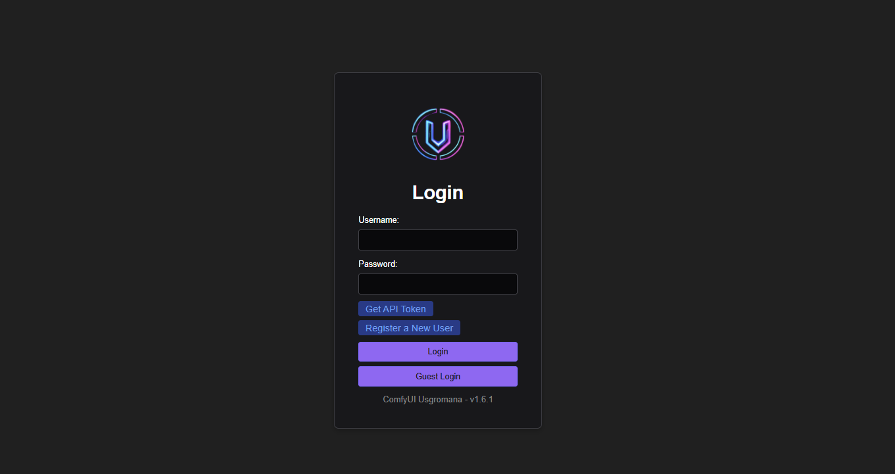
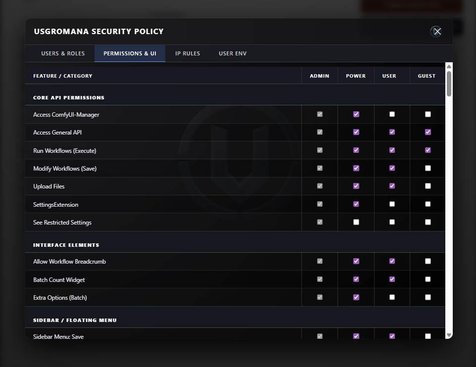
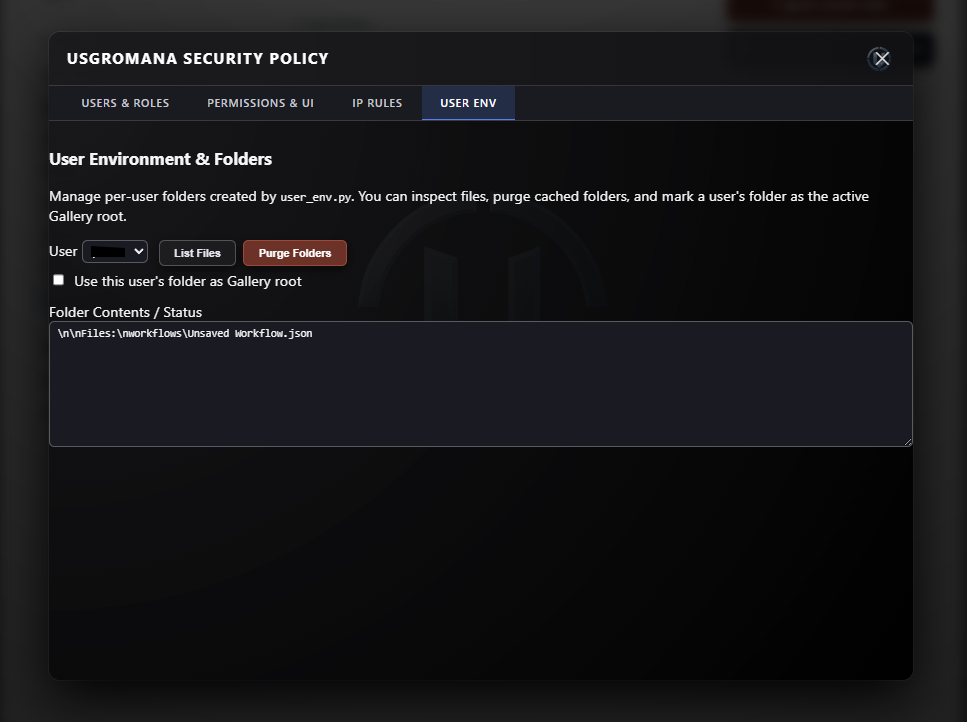

# ComfyUI Usgromana

<p align="center">
  
</p>

<p align="center">
  <strong>The next-generation security, governance, permissions, and multi‑user control system for ComfyUI.</strong>
</p>

<p align="center">
  <strong>Version 1.10.0</strong> — Latest release fixes ComfyUI Assets Generated tab, Comfy user bridge, and assets visibility integration
</p>

---

## Table of Contents
1. [Overview](#overview)  
2. [Key Features](#key-features)  
3. [Architecture](#architecture)  
4. [Installation](#installation)  
5. [Folder Structure](#folder-structure)  
6. [Configuration (config.json)](#configuration-configjson)  
7. [RBAC Roles](#rbac-roles)  
8. [UI Enforcement Layer](#ui-enforcement-layer)  
9. [Workflow Protection](#workflow-protection)  
10. [IP Rules System](#ip-rules-system)  
11. [User Environment Tools](#user-environment-tools)  
12. [Settings Panel](#settings-panel)  
13. [API Endpoints](#api-endpoints)  
14. [Backend Components](#backend-components)  
15. [Troubleshooting](#troubleshooting)  
16. [License](#license)

---

## Overview

**ComfyUI Usgromana** is a comprehensive security layer that adds:

- Role‑Based Access Control (RBAC)  
- UI element gating  
- Workflow save/delete blocking  
- Transparent user folder isolation  
- IP whitelist and blacklist enforcement  
- User environment management utilities  
- A modern administrative panel with multiple tabs  
- Dynamic theme integration with the ComfyUI dark mode  
- Live UI popups, toast notifications, and visual enforcement  
- **NSFW Guard API** - Public API for NSFW detection and enforcement
- **Gallery integration** - Manual image flagging and metadata-based tagging
- **Extension Tabs API** - Allow other extensions to add custom tabs to the admin panel

It replaces the older Sentinel system with a faster, cleaner, more modular architecture—fully rewritten for reliability and future expansion.

---

## Key Features

### 🔐 **RBAC Security**
Four roles: **Admin, Power, User, Guest**  
Each with configurable permissions stored in `usgromana_groups.json`.

<p align="center">
  
</p>

### 🚫 **Save & Delete Workflow Blocking**
Non‑privileged roles cannot:
- Save workflows  
- Export workflows  
- Overwrite existing workflows  
- Delete workflow files  

<p align="center">
  
</p>

All blocked actions trigger:
- A server‑side 403  
- A UI toast popup explaining the denial  

### 👁️ **Dynamic UI Enforcement**
Usgromana hides or disables:
- Top‑menu items  
- Sidebar tabs  
- Settings categories  
- Extension panels  
- File menu operations  

Enforcement occurs every 1 second to catch late‑loading UI elements.

### 🌐 **IP Filtering System**
Complete backend implementation:
- Whitelist mode  
- Blacklist mode  
- Live editing in Usgromana settings tab  
- Persistent storage via `ip_filter.py`  

### 🗂️ **User Environment Tools**
From `user_env.py`:
- Purge a user’s folders  
- List user-owned files
- Promote user workflow to default (all user view)
- Delete single user workflow
- Toggle gallery‑folder mode

<p align="center">
  
</p>

### 🖥️ **Transparent Themed Admin UI**
The administrative modal features:
- Transparent blurred glass background  
- Neon accent tabs  
- Integrated logo watermark  
- Scrollable permission tables  
- Responsive layout  

### 🔧 **Watcher Middleware**
A new middleware that detects:
- Forbidden workflow saves  
- Forbidden deletes  
And triggers UI-side toast popups through a custom fetch wrapper.

### 🛡️ **NSFW Guard API**
A comprehensive public API that allows other ComfyUI extensions to:
- Check user NSFW viewing permissions
- Validate image tensors, PIL Images, or file paths for NSFW content
- Integrate NSFW protection into custom nodes and extensions
- **Metadata-based tagging system** - Images are tagged with NSFW metadata stored alongside files
- **Gallery integration endpoint** - `/usgromana-gallery/mark-nsfw` for manual image flagging
- **Automatic scanning** - Background scanning of output directory with caching
- **Per-user enforcement** - SFW restrictions apply per-user based on role permissions

See [API_USAGE.md](./API_USAGE.md) for complete documentation and examples.

**Quick Example:**
```python
from api import check_tensor_nsfw, is_sfw_enforced_for_user

# In your custom node
if is_sfw_enforced_for_user():
    if check_tensor_nsfw(image_tensor):
        # Block or replace NSFW content
        image_tensor = torch.zeros_like(image_tensor)
```

**Gallery Integration:**
```javascript
// Mark an image as NSFW from gallery UI
fetch('/usgromana-gallery/mark-nsfw', {
    method: 'POST',
    headers: { 'Content-Type': 'application/json' },
    body: JSON.stringify({
        filename: 'image.png',
        is_nsfw: true,
        score: 1.0,
        label: 'manual'
    })
});
```

---

## Architecture

```
ComfyUI
│
├── Usgromana Core
│   ├── access_control.py    → RBAC, path blocking, folder isolation
│   ├── __init__.py          → Route registration, middleware setup
│   ├── api.py               → NSFW Guard API (public interface)
│   ├── globals.py           → Shared server instances, route table
│   ├── constants.py         → Configuration paths
│   ├── routes/
│   │   ├── auth.py          → Login/Register/Token endpoints
│   │   ├── admin.py         → User & Group management, NSFW admin tools
│   │   ├── user.py          → User environment, mark-nsfw endpoint
│   │   ├── static.py        → Asset serving
│   │   └── workflow_routes.py → Workflow protection, NSFW enforcement
│   ├── utils/
│   │   ├── ip_filter.py     → Whitelist/blacklist system
│   │   ├── user_env.py      → User folder management
│   │   ├── sanitizer.py     → Input scrubbing
│   │   ├── logger.py        → Logging hooks
│   │   ├── timeout.py       → Rate limiting
│   │   ├── sfw_intercept/
│   │   │   ├── nsfw_guard.py → NSFW detection, metadata tagging
│   │   │   └── node_interceptor.py → Node-level image interception
│   │   └── reactor_sfw_intercept.py → ReActor SFW patch
│   └── web/
│       ├── js/usgromana_settings.js → UI enforcement + settings panel
│       ├── css/usgromana.css        → Themed UI
│       └── assets/dark_logo_transparent.png
│
└── ComfyUI (upstream)
```

---

## Installation

1. Extract Usgromana into:
```
ComfyUI/custom_nodes/Usgromana/
```

2. Restart ComfyUI.

3. On first launch, register the initial admin.

4. Open settings → **Usgromana** to configure.

### Optional: NSFW Guard and public API

For full NSFW detection and the public API (`api.py`), install optional dependencies:

```bash
pip install -r requirements-optional.txt
```

Or with pip: `pip install transformers torch pillow numpy piexif`

Without these, the extension runs normally; NSFW guard and API calls degrade gracefully (e.g. no image scanning).

---

## Folder Structure

```
Usgromana/
│
├── __init__.py              → Main entry point, route registration
├── api.py                   → NSFW Guard API (public interface)
├── globals.py               → Shared server instances, route table
├── constants.py             → Configuration paths
├── access_control.py        → RBAC, path blocking, folder isolation
│
├── routes/
│   ├── auth.py              → Login/Register/Token endpoints
│   ├── admin.py             → User & Group management, NSFW admin tools
│   ├── user.py              → User environment, mark-nsfw endpoint
│   ├── static.py           → Asset serving
│   └── workflow_routes.py   → Workflow protection, NSFW enforcement
│
├── utils/
│   ├── ip_filter.py         → Whitelist/blacklist system
│   ├── user_env.py          → User folder management
│   ├── sanitizer.py         → Input scrubbing
│   ├── logger.py            → Logging hooks
│   ├── timeout.py           → Rate limiting
│   ├── sfw_intercept/
│   │   ├── nsfw_guard.py    → NSFW detection, metadata tagging
│   │   └── node_interceptor.py → Node-level image interception
│   └── reactor_sfw_intercept.py → ReActor SFW patch
│
├── web/
│   ├── js/usgromana_settings.js → UI enforcement + settings panel
│   ├── css/usgromana.css        → Themed UI
│   └── assets/dark_logo_transparent.png
│
└── users/
    ├── users.json
    └── usgromana_groups.json
```

---

## Configuration (config.json)

Configuration is read from `config.json` in the extension root. All paths are relative to the extension directory.

| Key | Description | Default |
|-----|-------------|--------|
| `secret_key_env` | Environment variable name for JWT secret | `SECRET_KEY` |
| `users_db` | Path to user database JSON | `users/users.json` |
| `whitelist` | Path to IP whitelist file | `users/whitelist.txt` |
| `blacklist` | Path to IP blacklist file | `users/blacklist.txt` |
| `access_token_expiration_hours` | JWT expiry in hours | `12` |
| `max_access_token_expiration_hours` | Max allowed expiry | `8760` |
| `log` | Log file name (under extension root) | `usgromana.log` |
| `log_levels` | Log levels list | `["INFO"]` |
| `blacklist_after_attempts` | Failed attempts before IP blacklist | `5` |
| `free_memory_on_logout` | Free memory on logout | `true` |
| `force_https` | Redirect HTTP to HTTPS | `false` |
| `seperate_users` | Per-user folder isolation (note: config key spelling kept for compatibility) | `true` |
| `manager_admin_only` | Restrict manager to admins | `true` |

---

## RBAC Roles

| Role | Description |
|------|-------------|
| **Admin** | Full access to all ComfyUI and Usgromana features. |
| **Power** | Elevated user with additional permissions but no admin panel access. |
| **User** | Standard user who can run workflows but cannot modify system behavior. |
| **Guest** | Fully restricted by default—cannot run, upload, save, or manage. |

Permissions are stored in:

```
users/usgromana_groups.json
```

and editable through the settings panel.

---

## UI Enforcement Layer

Usgromana dynamically modifies the UI by:
- Injecting CSS rules to hide elements
- Removing menu entries (Save, Load, Manage Extensions)
- Blocking iTools, Crystools, rgthree, ImpactPack for restricted roles
- Guarding PrimeVue dialogs (Save workflow warnings)
- Intercepting hotkeys (Ctrl+S, Ctrl+O)

All logic is contained in:

```
web/js/usgromana_settings.js
```

---

## Workflow Protection

If a user lacking permission tries to save:

1. Backend blocks the operation (`can_modify_workflows`)
2. watcher.py detects the 403 with code `"WORKFLOW_SAVE_DENIED"`
3. UI shows a centered toast popup:
   > “You do not have permission to save workflows.”

Same for delete operations.

---

## IP Rules System

Located in:

```
utils/ip_filter.py
```

### Features
- Whitelist mode: Only listed IPs allowed
- Blacklist mode: Block specific IPs
- Configurable through new “IP Rules” tab in settings
- Changes applied instantly to middleware

---

## User Environment Tools

From:

```
utils/user_env.py
```

Features:
- Purge a user’s input/output/temp folders
- List all user-bound files
- Toggle whether their folder functions as a gallery

Exposed through the “User Env” tab in the Usgromana settings modal.

---

## Settings Panel

Access via:
**Settings → Usgromana**

Tabs:

1. **Users & Roles**  
2. **Permissions & UI**  
3. **IP Rules**  
4. **User Environment**  
5. **NSFW Management**

### Extension Tabs API

Other ComfyUI extensions can register custom tabs in the Usgromana admin panel to manage their own permissions and settings. See [EXTENSION_TABS_API.md](./EXTENSION_TABS_API.md) for complete documentation.

**Quick Example:**
```javascript
window.UsgromanaAdminTabs.register({
    id: "myextension",
    label: "My Extension",
    order: 50,
    render: async (container, context) => {
        const { usersList, groupsConfig, currentUser } = context;
        container.innerHTML = `<h3>My Extension Settings</h3>`;
        // Render your content here
    }
});
```

### Additional UI Features
- Integrated logout button in the settings entry  
- Transparent blurred panel  
- Neon-accented tab bar  
- Logo watermark in top-right  

---

## API Endpoints

### NSFW Guard API (Public)
The NSFW Guard API provides programmatic access to NSFW detection and enforcement. See [API_USAGE.md](./API_USAGE.md) for complete documentation.

**Key Functions:**
- `check_tensor_nsfw(images_tensor, threshold=0.5)` - Check image tensors
- `check_image_path_nsfw(image_path, username=None)` - Check image files
- `check_pil_image_nsfw(pil_image, threshold=0.5)` - Check PIL Images
- `is_sfw_enforced_for_user(username=None)` - Check user restrictions
- `set_image_nsfw_tag(image_path, is_nsfw, score=1.0, label="manual")` - Tag images
- `get_image_nsfw_tag(image_path)` - Get existing tags

### Gallery Integration Endpoint

**POST `/usgromana-gallery/mark-nsfw`**
Manually mark an image as NSFW or SFW. Designed for integration with gallery extensions.

**Request Body:**
```json
{
    "filename": "image.png",
    "is_nsfw": true,
    "score": 1.0,      // optional, default 1.0
    "label": "manual"  // optional, default "manual"
}
```

**Response:**
```json
{
    "status": "ok",
    "message": "Image marked as NSFW",
    "filename": "image.png",
    "is_nsfw": true
}
```

**Features:**
- Recursively searches output directory subdirectories
- Security checks prevent path traversal
- Integrates with metadata tagging system
- Returns 404 if file not found, 403 for invalid paths

### Authentication Endpoints

**POST `/usgromana/api/login`** - User login  
**POST `/usgromana/api/register`** - User registration  
**POST `/usgromana/api/guest-login`** - Guest login  
**POST `/usgromana/api/refresh-token`** - Token refresh

### Admin Endpoints

**GET/PUT `/usgromana/api/users`** - User management  
**GET/PUT `/usgromana/api/groups`** - Group/permission management  
**PUT `/usgromana/api/ip-lists`** - IP whitelist/blacklist  
**POST `/usgromana/api/nsfw-management`** - NSFW admin tools (scan, fix, clear)

### User Environment Endpoints

**POST `/usgromana/api/user-env`** - User folder operations (purge, list, promote)

### Extension Integration

**Extension Tabs API** - JavaScript API for extensions to add custom tabs to the admin panel. See [EXTENSION_TABS_API.md](./EXTENSION_TABS_API.md) for complete documentation.

---

## Backend Components

### `__init__.py`
- Main entry point for ComfyUI extension
- Route registration and middleware setup
- Server instance initialization

### `api.py`
- **NSFW Guard API** - Public interface for other extensions
- Functions: `check_tensor_nsfw()`, `check_image_path_nsfw()`, `is_sfw_enforced_for_user()`
- Metadata tagging: `set_image_nsfw_tag()`, `get_image_nsfw_tag()`
- User context management for worker threads

### `access_control.py`
- Folder isolation  
- RBAC  
- Middleware for blocking paths  
- Workflow protection  
- Extension gating  

### `routes/auth.py`
- JWT authentication endpoints
- Login, registration, token refresh
- Guest login support

### `routes/admin.py`
- User & group management
- Permission editing
- NSFW management tools (scan, fix, clear)
- IP rules management

### `routes/user.py`
- User environment operations
- **Gallery integration**: `/usgromana-gallery/mark-nsfw` endpoint
- File management (purge, list, promote workflows)

### `routes/workflow_routes.py`
- Workflow save/delete protection
- Global NSFW enforcement on `/view` endpoint
- Workflow listing and loading

### `routes/static.py`
- Asset serving (CSS, JS, images)
- Logo and UI resources

### `utils/sfw_intercept/nsfw_guard.py`
- NSFW detection using AI models
- Metadata-based tagging system
- Background scanning and caching
- Per-user enforcement logic

### `utils/sfw_intercept/node_interceptor.py`
- Node-level image interception
- Real-time NSFW blocking in custom nodes

### `utils/reactor_sfw_intercept.py`
- ReActor extension SFW patch
- Per-user SFW enforcement for face swap operations

### `utils/sanitizer.py`
- Sanitization applies to **form POST** body and **query parameters** only. JSON request bodies (workflow save, admin APIs) are not sanitized.

### `utils/ip_filter.py`
- Whitelist & blacklist logic
- Persistent storage

### `utils/user_env.py`
- Folder operations
- Metadata tools
- User file management

---

## Tests

Minimal unit tests are in `tests/`. Run them with:

```bash
pip install pytest   # or use requirements-dev.txt
pytest tests/ -v
```

Tests cover `sanitize_name` (path traversal), `get_file_info`, and JWT encode/decode with a test secret. Running `pytest tests/` uses `tests/` as the pytest rootdir so the extension root is not loaded; `get_file_info` is skipped when the extension cannot be imported outside ComfyUI.

---

## Troubleshooting

### Missing Logo
Ensure the file exists:
```
Usgromana/web/assets/dark_logo_transparent.png
```

### UI Not Updating
Clear browser cache or disable caching dev tools.

### Guest cannot run workflows
Check:
```
can_run = true
```
in `usgromana_groups.json`.

### mark-nsfw endpoint returns 404
- Ensure the image file exists in the output directory or subdirectories
- Check that the filename doesn't contain path traversal characters (`..`, `/`, `\`)
- Verify the file is within the output directory (security check)

### NSFW Guard API not working
- Ensure `ComfyUI-Usgromana` is loaded before your extension
- Check that the API is available: `from api import is_available; print(is_available())`
- Verify user context is set in worker threads using `set_user_context()`

### NSFW tags not persisting
- Check that metadata files (`.nsfw_metadata.json`) are being created alongside images
- Verify write permissions in the output directory
- Ensure metadata files aren't being deleted by cleanup scripts

---

## License
MIT License  
You may modify and redistribute freely.

---

# Changelog — ComfyUI Usgromana

All notable changes to **ComfyUI Usgromana** are documented here.  
This project follows a semantic-style versioning flow adapted for active development.

---

## **v1.10.0 — ComfyUI Assets Generated Tab & User Bridge (2026-05-16)**

### Assets → Generated tab (critical)
- **Root cause** — ComfyUI’s Generated tab loads **`/api/jobs`** (completed prompt history with `preview_output`), not **`/api/assets`**. Registry repair and asset seeding alone did not populate the UI.
- **Jobs merge** — Disk-backed output images from the assets database are merged into **`GET /api/jobs`** as synthetic completed jobs (`utils/comfy_user_bridge.py`).
- **Fallback API** — New **`GET /usgromana/api/generated-jobs`** returns the same job-shaped rows for debugging and clients.
- **Frontend** — `web/js/comfy_user_bridge.js` patches **`api.getHistory()`** to merge disk images when the server merge is not used.

### Asset registry & listing
- **`output` tag backfill** — Old files under `output/` that the seeder skipped now receive the `output` tag via repair/backfill.
- **`is_missing` repair** — Clears `is_missing` when the file still exists on disk.
- **Duplicate `file_path` rows** — Repair merges or deletes duplicates instead of failing with `IntegrityError`.
- **Thumbnail rows** — Excludes `output/_thumbs/` from Generated listings; purges thumb asset rows from the DB.
- **API handler rebind** — Patches `list_assets_page` on `asset_management`, `app.assets.services`, and **`app.assets.api.routes`** (import-by-value safe); re-binds on each **`GET /api/assets`**.

### Default UI & visibility
- **`assets_imports_visibility`** — Default UI setting (`user_specific` / `allow_all` / `disable_all`) now applies to Comfy Assets listing and gallery scan paths.
- **`allow_all` owner scope** — `_all_owners_visible()` patches `build_visible_owner_clause` in all query modules that import it by value.

### ComfyUI user / session bridge
- **Built-in user picker** — Disabled multi-user picker when Usgromana owns authentication (`prestartup_script.py`, users route patch).
- **JWT username in middleware** — Workflow middleware reads `request["user"]` as a username string (not a dict), fixing guest fallback for SFW/session checks.
- **Comfy-User header** — Frontend sets **Comfy-User** from `/usgromana/api/me` for assets and Comfy APIs.
- **Auto-enable assets** — `prestartup_script.py` / `enable_comfy_assets.py` enable Comfy’s assets system without `--enable-assets`.

### Other
- **NSFW on asset lists** — Optional filter pass on asset list results when SFW is enforced for the session user.
- **Output registry repair** — Runs on Generated-related requests and when Default UI visibility changes (background thread).

---

## **v 1.7.9 - Critical issue resol ed
## 🛡️ NSFW API
  - **Metadata tag wipe
    - Resolved an issue which caused the metadata to be removed from images after being tagged as NSFW.

=======

## **v1.7.7 — NSFW Guard API & Gallery Integration (2025-12-12)**
### 🛡️ NSFW Guard API Enhancements
- **Metadata-based tagging system** 
  - Images are now tagged with NSFW metadata stored alongside files (`.nsfw_metadata.json`)
- **Gallery integration endpoint** 
  - New `/usgromana-gallery/mark-nsfw` endpoint for manual image flagging from gallery UIs
- **Recursive file search** 
  - mark-nsfw endpoint now searches subdirectories to find images
- **Enhanced API functions** 
  - Added `set_image_nsfw_tag()` for programmatic tagging
- **Background scanning** 
  - Automatic scanning of output directory with intelligent caching
- **Per-user enforcement** 
  - SFW restrictions apply per-user based on role permissions

### 🔗 Gallery Integration
- **ComfyUI-Usgromana-Gallery compatibility** 
  - Full integration with gallery extension
- **Manual flagging** 
  - Users can manually mark images as NSFW/SFW through gallery UI
- **Metadata persistence** 
  - NSFW tags persist across server restarts via metadata files

### 🛠️ Route Registration Improvements
- **Explicit route registration** 
  - Routes are now explicitly registered to ensure availability
- **Middleware whitelisting** 
  - Gallery routes are properly whitelisted in workflow middleware
- **Route verification** 
  - Startup verification ensures all routes are properly registered

### 📂 Architecture Updates
- **Modular route structure** 
  - Routes organized into dedicated modules (`routes/` directory)
- **Separation of concerns** 
  - NSFW logic separated into `utils/sfw_intercept/` module
- **Public API module** 
  - `api.py` provides clean public interface for other extensions

---

## **v1.7.5 - Critical issue resolution**
### 🛠️ Admin workflow
  - resolved an issue which barred admins from deleting default workflows
  - resolved and issue with extension name causing UI block to fail

## **v1.7.0 - Updated extension logic & added sfw toggle
### 🛠️ Admin User group Extension list
  - Resolved an issue which caused duplicate extensions to be listed
  - List now accounts for explicitly listed extensions
### 🛠️ Per user SFW reactor intercept (Highly experimental)
  - Admin can now toggle SFW on/off per user
  - `utils/reactor_sfw_intercept.py` (added new file)

## **v1.6.0 - Refactor & update User Workflow Administration
### 📂 User Files Additions
- **Monolith Addition:** Added options to select and delete individual files & Promote Workflows
  - `routes/user.py` (Updated information passage)
  - `web/usgromana_settings.js` (updated the middleware and UI architecture)

## **v1.5.0 — Modular Refactor & Architecture Overhaul (2025-12-6)**
### 🏗️ Architectural Refactor
- **Monolith Split:** Deconstructed the massive `usgromana.py` into modular route handlers:
  - `routes/auth.py` (Login/Register/Token)
  - `routes/admin.py` (User & Group management)
  - `routes/user.py` (User environment & status)
  - `routes/static.py` (Asset serving)
- **Circular Dependency Resolution:** Introduced `globals.py` to handle shared server instances and `constants.py` to centralize configuration paths.
- **Logic Decoupling:** Moved business logic out of HTTP handlers into dedicated utilities (`utils/admin_logic.py`, `utils/json_utils.py`, `utils/bootstrap.py`).

### 🛠️ Stability & Fixes
- **Startup Resilience:** Added auto-creation logic for missing static folders (`web/css`, `web/js`, `web/html`) to prevent `aiohttp` crash on first run.
- **Windows Pathing:** Fixed `FileNotFoundError` and path resolution issues on Windows environments.
- **Middleware Fixes:** Restored missing `create_folder_access_control_middleware` and fixed import errors in `watcher.py`.
- **Config Correction:** Resolved missing `MAX_TOKEN_EXPIRE_MINUTES` constant that prevented server startup.

### 📂 Frontend Reorganization
- Restructured `web/` directory for cleaner separation of concerns.
- Consolidated ComfyUI extension scripts (`usgromana_settings.js`, `logout.js`, `injectCSS.js`) to ensure reliable auto-loading.
- Moved HTML templates to `web/html/` and updated static route mappings.
- Removed legacy `admin.js` to prevent conflicts with the integrated Settings UI.

---

## **v1.4.0 — Major Security & UI Expansion**
### 🔥 New Features
- Added **multi-tab Usgromana Settings Panel**  
  - Users & Roles  
  - Permissions & UI  
  - IP Rules  
  - User Environment  
- Introduced **logout button** inside Usgromana settings.
- Implemented **transparent glass UI theme** with background blur.
- Added **Usgromana logo watermark** support in upper-right corner.

### 🔐 Security Enhancements
- Full **save/delete workflow blocking** for restricted roles.
- New `watcher.py` middleware to detect backend 403s and send structured UI warnings.
- Unified blocking under `WORKFLOW_SAVE_DENIED` and `WORKFLOW_DELETE_DENIED` codes.
- Strengthened **RBAC defaults** for guest accounts.
- Added **extension UI gating** via CSS + runtime menu removal.

### 🧠 Backend Improvements
- New IP filtering system (`ip_filter.py`) with whitelist + blacklist modes.
- New User Environment tools (`user_env.py`) including:  
  - Folder purge  
  - File listing  
  - Gallery-mode toggles  
- Added `create_usgromana_middleware()` unified security layer.
- Path blocking now includes extension routes, workflow endpoints, manager access, and asset paths.

---

## **v1.3.0 — UI Enforcement Engine Overhaul**
### ✨ Enhancements
- Added dynamic scanning of:  
  - PrimeVue menus  
  - Sidebar buttons  
  - Settings categories  
- Enforcement now applies every second to catch late UI loads.
- Added hotkey interception (Ctrl+S / Ctrl+O) for restricted roles.
- Rebuilt `patchSaveConfirmDialog` to override PrimeVue dialogs.

### 🛠 Stability Updates
- Resolved issues where guests could open extension settings.
- Added safe defaults for undefined permissions per role.

---

## **v1.2.0 — Folder Isolation & User Paths**
### 🔧 New Features
- Added per-user:  
  - input directory  
  - output directory  
  - temp directory  
- Automatic directory creation with fallback to “public” user.
- Added `filename_prefix` rewriting for isolated naming.

### 🐞 Fixes
- Corrected queue ownership tracking.
- Fixed history objects containing mixed-user entries.

---

## **v1.1.0 — JWT Authentication Integration**
### 🚀 Additions
- Added JWT login, registration, expiration, and cookie storage.
- Implemented guest login with auto-created “guest” user.
- Created protections to ensure guest cannot escalate privileges.

### ⚙ Backend
- Refactored user database operations.
- Added detection for first-time admin setup.

---

## **v1.0.0 — Initial Release**
- Base RBAC system  
- Permission flags stored in `usgromana_groups.json`  
- Middleware for execution, upload, manager access  
- Basic UI blocking  
- Initial Usgromana settings entry (pre-tabs)

---

## Upcoming Features (Planned for v1.5+)
- Live audit logging panel  
- Real-time session viewer  
- Admin ability to force logout users  
- Per-user storage quotas  
- Automated workflow sandboxing  
- Theme customization panel

---

